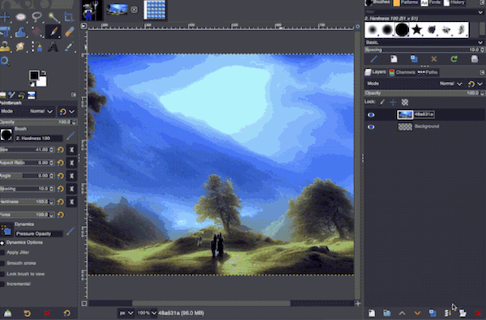
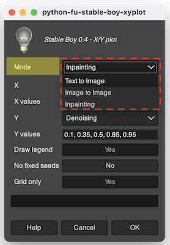

<a name="readme-top"></a>

<div>
<h1 align="center">Stable Boy</h1>
  <p align="center">
    A GIMP plugin for AUTOMATIC1111's Stable Diffusion WebUI
  </p>
</div>

## About

[AUTOMATIC1111's Stable Diffusion WebUI](https://github.com/AUTOMATIC1111/stable-diffusion-webui) is one of the most powerful tools in the generative AI space. Stable Boy puts that power into GIMP 2.10 by calling into A1111 WebUI's API.

Here's a short demo video (of v0.1 ... haven't found time to make a new one):

[](https://youtu.be/YMVog30OcTI)

<p align="right">(<a href="#readme-top">back to top</a>)</p>


## Installation

1. Clone the repo:
   ```sh
   git clone https://github.com/thndrbrrr/gimp-stable-boy.git
   ```
1. Start GIMP, open Preferences and add the absolute path to _sub-folder_ (!) `src` to GIMP's plugin search path:
   ```
   /home/...and-so-on.../gimp-stable-boy/src     # MacOS, Linux
   C:/Users/...and-so-on.../gimp-stable-boy/src  # Windows
   ```
   
1. Restart GIMP.
1. Start A1111 WebUI with argument `--api`. It doesn't matter whether it's running on your local machine or somewhere in the cloud.
1. Open Stable Boy's preferences (top menu > Stable Boy > Preferences) and copy-paste A1111 WebUI's URL (something like `https://abcdef123.gradio.com`) into the `API URL` field.

<p align="right">(<a href="#readme-top">back to top</a>)</p>


## Usage

Stable Boy can be found in the `Stable Boy` top menu, with the following options:
- Preferences
- Text to Image
- Image to Image
- Inpainting
- Upscale
- Scripts
  - X/Y plot

> ℹ️ Stable Boy's menu items will be grayed out if no image is open. 

### Model selection

Stable Boy currently doesn't have an option to choose the model. You'll have to do that in WebUI. Loading an inpainting model is recommended.

### Image size

The minimum resolution is 512x512. Ideally choose dimensions that are multiples of 256.

### Generate images or layers

Stable Boy can open results coming from Stable Diffusion as new images, or they can be added as new layers to the current image. The `Results as` option dropdown lets you control this.

Using layers is very powerful, especially when inpainting large images.

### Inpainting

Add a layer named `Inpainting Mask` to the image and make it the top layer. Use a paintbrush and paint the region you want to inpaint with black on that mask layer. Stable Boy will automatically determine the area of the image to process (multiples of 256 and at least 512x512). When results are added as layers, the inpainting mask is applied to those layers so that they really only contain the masked part.

In the GIF below you can see how multiple variations of inpainting are added as layers, which can then be compared easily:

<!--  -->


Stable Boy inserts any generated layers below the inpainting mask layer and then hides the mask layer. The mask itself remains as is.

> 👉 Select the mask layer and hit `DEL` to clear the mask.

### X/Y plotting

X/Y plotting is an essential step in generative art workflows: since changes in parameters are not immediate and multiple parameters often work in conjunction, the best way to go about it is to compare the results of different settings in an X/Y plot. When using Image to Image for example, an X/Y plot of multiple CFG scales and denoising strengths makes it very easy to determine the right combination:


The result of X/Y plot is a grid as well as the individual images. Use the `Grid only` option to control whether the individual images should be included. As can be seen in the GIF image above, grids are always opened as separate images, whereas individual result images are added to the existing image as nested layer groups. Each layer is named after its X/Y parameter combination.

When running the X/Y plot script you'll have to choose a mode (Text to Image, Image to Image, or Inpainting). The script will then use that mode's settings from the last time that mode was run:



**NOTE:** For now, script support is **disabled** by default since some changes to A1111's API are necessary. The branch with the required A1111 SD WebUI API changes can be found here: `https://github.com/thndrbrrr/stable-diffusion-webui/tree/script-api`. There is also a [pull request for these API changes](https://github.com/AUTOMATIC1111/stable-diffusion-webui/pull/5940) but it hasn't been merged yet. Once you are running A1111 with the required API changes you can enable X/Y plot by editing `src/gimp_stable_boy/config.py` and setting `Config.ENABLE_SCRIPTS` to `True`.

### Support for Rectangle Selection tool

Use rectangular selections for selecting the region that Stable Diffusion will process. This makes it possible to work with images of arbitrary size. Note that **the selection's width and height need to be multiples of 8**. Think `512x512`, `512x768`, `1024x768`, that kinda thing.

> 👉 Using GIMP's fixed-size rectangular selections makes this easy.

<!-- 🔴🔴🔴 GIF GIF GIF -->

If there is neither a selection nor an inpainting mask (see below), Stable Boy will process the full image. (Therefore image sizes should also be multiples of 8.)

<p align="right">(<a href="#readme-top">back to top</a>)</p>


## Roadmap

- [x] ~~Rectangular selections as image sources for each mode~~
- [x] ~~Inpainting on large images: Stable Boy determines the region to send to Stable Diffusion based on where you painted the mask~~
- [x] ~~Script: X/Y plot~~
- [ ] Outpainting
- [ ] Better GUI
- [ ] Keep metadata (seed, sampler settings and such)
- [ ] Support for more options
- [ ] Better documentation

See the [open issues](https://github.com/tgiesselmann/gimp-stable-boy/issues) for known issues.

<p align="right">(<a href="#readme-top">back to top</a>)</p>


## Contributing

Contributions are what make the open source community such an amazing place to learn, inspire, and create. Any contributions you make are **greatly appreciated**. If you have a suggestion that would make this better, please fork the repo and create a pull request. Thank you!

1. Fork the project
2. Create your feature branch (`git checkout -b feature/amazing-feature`)
3. Commit your changes (`git commit -m 'Adding some amazing feature'`)
4. Push to the branch (`git push origin feature/amazing-feature`)
5. Open a pull request

<p align="right">(<a href="#readme-top">back to top</a>)</p>


## License

Distributed under the GNU General Public License v3.0. See file [`COPYING`](COPYING) for more information.

<p align="right">(<a href="#readme-top">back to top</a>)</p>


## Contact

Mail: thndrbrrr@gmail.com

Mastodon: [@torben@mastodon.sdf.org](https://mastodon.sdf.org/@torben)

<p align="right">(<a href="#readme-top">back to top</a>)</p>


## Acknowledgments

In the end, everyone stands on the shoulders of giants.

* [Stable Diffusion](https://github.com/CompVis/stable-diffusion)
* [AUTOMATIC1111](https://github.com/AUTOMATIC1111/stable-diffusion-webui)
* [GIMP](https://www.gimp.org/)
* [blueturtleai's gimp-stable-diffusion](https://github.com/blueturtleai/gimp-stable-diffusion)
* [Stack Overflow](https://stackoverflow.com/)
* [Daniel Alcalde Puente](https://github.com/danielalcalde)
* [beothorn](https://github.com/beothorn)
* [Othneil Drew](https://github.com/othneildrew)

<p align="right">(<a href="#readme-top">back to top</a>)</p>
